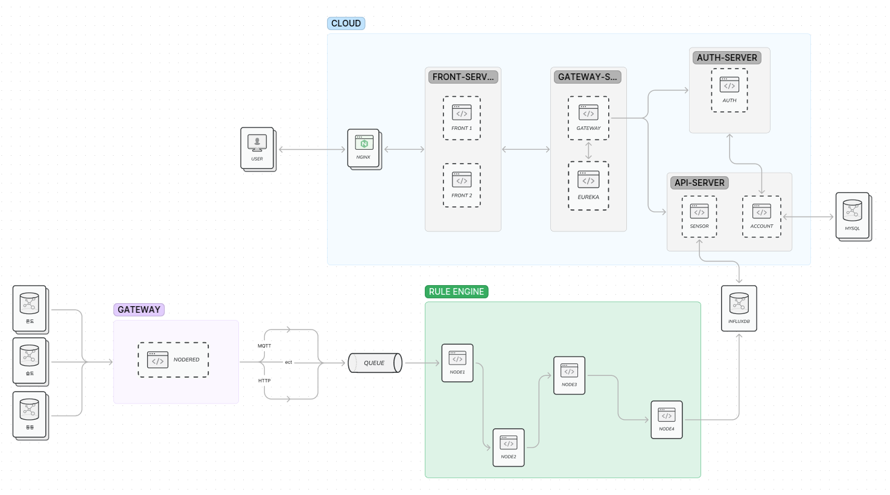

# DATABO3 프로젝트 (TEAM 3)

## :busts_in_silhouette: 팀 구성원
| 이 름 |                 깃허브 주소                  | 
|:---:|:---------------------------------------:|
| 강경훈 |  [GitHub](https://github.com/kkh5535)  |
| 나채현 |  [GitHub](https://github.com/chaehyonNa)  |
| 박상진 | [GitHub](https://github.com/Mizz1ove) |
| 양현성 | [GitHub](https://github.com/HyeonSeon9) |
| 윤인섭 | [GitHub](https://github.com/insub2004)  |
| 이지현 | [GitHub](https://github.com/badgelatte) |
| 정세인 |   [GitHub](https://github.com/SeinJs)   |

## :dart: 목표

사무실의 쾌적한 상태를 유지하기 위한 에너지 효율 관리 서비스를 개발하는 것이 우리 팀의 목표입니다. 이 서비스는 현재 사무실의 환경 상태를 실시간으로 모니터링하고, 사용자가 원하는 설정 값에 따라 자동으로 제어할 수 있는 기능을 제공합니다. 이를 통해 에너지 소비를 최적화하고, 효율적인 사무실 환경을 유지할 수 있도록 합니다.

## :clipboard: 프로젝트 설명

우리 팀은 사무실의 환경을 관리하기 위한 에너지 효율 서비스를 개발하는 프로젝트를 수행하고 있습니다. 이 서비스는 사용자가 사무실의 조명, 온도 등과 같은 환경 요소를 모니터링하고 제어할 수 있도록 합니다. 또한 사용자가 설정한 값에 따라 자동으로 환경을 조절하여 에너지를 절약하고 편의성을 제공합니다.

## :classical_building: 설계

- **기본 아키텍쳐**

## :globe_with_meridians: 기능

### 요구사항

**Web**

<ol>
  <li> Front </li>
    <ul>
      <li>DashBoard view</li>
      <li>인증 여부에 따라 서비스 페이지 접근</li>
      <li>권한 별 접근 페이지 분리(Admin, Owner)</li>
      <li>실시간 차트 시각화</li>
      <li>jwt 토큰 만료일 확인 (spring security)</li>
      <li>github, payco Oauth 로그인</li>
    </ul>
   
  
  <li>Gateway</li>
    <ul>
      <li>라우팅</li>
      <li>로드밸런싱</li>
      <li>jwt 토큰 검증</li>
      <li>Blacklist 관리</li>
    </ul>
   
  
  <li>Eureka (서버)</li>
    <ul>
      <li>security</li>
      <li>eureka client 관리</li>
    </ul>
   
  
  <li> Account (계정) </li>
    <ul>
      <li> 로그인 </li>
      <li> 로그아웃 </li>
      <li> 회원가입 </li>
      <li> 회원탈퇴 </li>
    </ul>
   
  
  <li>Auth (인증)</li>
   <ul>
     <li>로그인 검증</li>
     <li>jwt 토큰 발급, 재발급</li>
   </ul>
    
   
</ol>

--- 

**IoT**

에너지 관련

1. 온도
    - 출근(재실모니터링으로 확인) 시 에어컨 or 히터 ON
    - 퇴근 시 에어컨 or 히터 OFF
    - 원하는 온도 설정 시 에어컨 or 히터로 관리 -> ex. 1분동안 받은 온도 데이터가 원하는 온도가 나오지 않으면 에어컨 온도를 내림
    
2. 습도
    - 일정 수치(비 오는날, 건조한날) 제습기 ON
    - co2 일정 수치 이상 공기 청정기 ON

3. 전력
    - 전월량 비교
    - 전력 소비 ai로 예측, 일정 수치에 도달하면 일부 기능 강제 OFF

4. 에너지 관련 추가 선택 사항
    - 직원 수 식별 기능 (인원 상황에 따라 차별된 환경)

---

### 제어

 1. 스위치 
 2. 램프

---

### 추가 선택 사항

   - 사용하지 않는 기기 알려줌 -> 차단

**상세한 내용은 [여기](https://github.com/nhnacademy-aiot1-team3/.github/blob/master/profile/docs/%EC%83%81%EC%84%B8%20%EC%9A%94%EA%B5%AC%EC%82%AC%ED%95%AD.md)에 있습니다.**

## :wrench: 개발 기술 스텍

### Language

- 
- 
- 
- 

### Framework

- 
- 
- 
- 
- 
- 
- 

### CI/CD

- 
- 
- 

### DB

- 
- 

## :memo: API 명세서
- ### [명세서](https://github.com/nhnacademy-aiot1-team3/.github/wiki/API-%EB%AA%85%EC%84%B8%EC%84%9C)
